# Detecting memory leaks in simulations

Goal: Detect memory leaks in myokit simulations (C-extensions compiled on-the-fly).

## Tools:

- [psutil](https://psutil.readthedocs.io) provides low-level process info.
- [resource](https://docs.python.org/3/library/resource.html) provides maximum memory use (part of standard library).
- [gc](https://docs.python.org/3/library/gc.html) provides information about garbage collection (part of standard library).
- [tracemalloc](https://docs.python.org/3/library/tracemalloc.html) provides information about memory managed by Python (part of standard library since 3.4).
- [pympler](https://pympler.readthedocs.io/en/latest/library/tracker.html) tracks Python objects and the memory they use.

Summary:

Using `psutil` and `resource` we can see the total process memory usage, but we can't learn which parts of our program are using the memory.
Some oddities in the output returned by `psutil` and `resource` are explained by looking at garbage collection via `gc`.
Using `pympler` and `tracemalloc` we can get very detailed insight into memory usage, but only for Python objects (either in pure Python or C extenions, but not memory allocated in C).
Since no tool is perfect we need several.

### psutil

On linux, we can look at memory usage of a running process with `ps`.

For example, run this:
```
import os
print(f'PID: {os.getpid()}')
input()
```
Then use `ps` from another window to check.
For example, if our PID is 181595:
```
[michael@localhost ~]$ ps u 181111
USER         PID %CPU %MEM    VSZ   RSS TTY      STAT START   TIME COMMAND
michael   181595  0.1  0.0 229204  8772 pts/2    S+   15:13   0:00 python3 ./test.py
```
The important numbers here are `VSZ` (Virtual memory size) and `RSS` (resident set size).

- [Virtual memory size](https://en.wikipedia.org/wiki/Virtual_memory) shows the total memory allocated to a process, including RAM and storage in swap files.
- [Resident set size](https://en.wikipedia.org/wiki/Resident_set_size) shows the total memory in RAM used by a process, including heap & stack.

Resident set size can underestimate because it doesn't include "memory" in swap files, but it can also overestimate if it includes memory used by shared libraries (so that shutting our process down wouldn't actually free up that memory, if others still use the library).
Virtual memory size overestimates, as it shows memory available to a process even when it isn't being used.

We can see the same information in `top` or `htop`, only now VSZ is called `VIRT` and RSS is called `RES`.
On windows VSZ is called `pagefile` and RSS is called `wset`.

Staying in Python, we can install `psutil` and use the [memory_info() method](https://psutil.readthedocs.io/en/latest/#psutil.Process.memory_info) method of the [Process class](https://psutil.readthedocs.io/en/latest/#process-class).

```
import os

import psutil

def bytes(b):
    if b < 1024:
        print(f'{b} bytes')
    if b < 1048576:
        print(f'{round(b / 1024, 1)} kb')
    else:
        print(f'{round(b / 1048576, 1)} mb')


pid = os.getpid()
print(f'PID: {pid}')
info = psutil.Process(pid).mem_info()
print(b(info.vms))
print(b(info.rss))
input()
```

shows

```
PID: 186661
226.7 mb
11.7 mb
```

### resource

Like `psutil`, the `resource` module gets information from the operating system.
Unlike `psutil`, it's part of the standard library and focusses on the current process (`psutil` can tell you about any running process).

To get info on the current process, including all threads but no child processes, we can use [RUSAGE_SELF](https://docs.python.org/3/library/resource.html#resource.RUSAGE_SELF):

```
import resource
usage = resource.getrusage(resource.RUSAGE_SELF)
```

The returned object has [a number of fields](https://docs.python.org/3/library/resource.html#resource.getrusage) whose meaning is platform dependent and explained e.g. [here](https://manpages.debian.org/bullseye/manpages-dev/getrusage.2.en.html).
The list seems to have arisen historically, and contains a bunch of entries that aren't very usefull or even not filled in.
Here we'll focus on `max_rss`, which contains the **maximum resident set size** used by our process so far.

```
import resource
print(resource.getrusage(resource.RUSAGE_SELF).ru_maxrss)
```
shows e.g.
```
9928
```
On linux, this is in units of kilobyte (or kibibyte? I don't know).

### Garbage collection

Python uses [garbage collection](https://devguide.python.org/internals/garbage-collector/), and we can learn about the garbage collector's current state from the `gc` module.

Important things to know:

- Python's garbage collection keeps track of "non-atomic" objects, e.g. user-defined objects and lists, but not of simpler objects (e.g. ints).
- Python objects all maintain their own reference count. When the ref count of a simple (atomic) object hits zero, it will free its memory.
- More complex objects may not free their memory until the garbage collector is run.
- Instead of using e.g. `malloc` and `free` all the time, Python uses its own allocation and freeing methods, so that it can re-use a single block of memory. If more is needed Python asks for more. This means you won't see small memory leaks directly in your RSS.
- Some things are cached which you might not expect, for example: `x = 5; y = 5; x is y` returns `True` because Python caches the integer objects from -5 to 256 for re-use.

Less important:

- Objects tracked by `gc` are stored in one of three "generations".
- New objects are added to generation 0. If it survives a generation 0 garbage collection it will be moved to generation 1. If it survives a generation 1 run it gets moved to generation 2.

### tracemalloc

What about objects that are not managed by GC?
Since Python 3.4, we can track those using the standard library module `tracemalloc`.
This tracks where and when memory was allocated by Python.
You can use it to do clever things, like showing which objects are using memory, and where they were defined.

For some reason, I can't get it to work nicely.
See [case-2-tracemalloc-example.py](./case-2-tracemalloc-example.py).

### pympler

Pympler incorporates several tools including `muppy`, which seems to be the one we use here.
It can track all Python objects currently in use, and show you the ones that were added or removed since your last call.
This means we can track leaks of (certain!) Python objects with pympler.

In particular, Pympler seems to track (1) objects that are [tracked by `gc`](https://docs.python.org/3/library/gc.html#gc.is_tracked), and (2) objects that are referenced by objects that are tracked by `gc`.
I'm not sure that this is correct or the full story, see [case-1-pympler-limitation.py](./case-1-pympler-limitation.py).

However, it's a super useful tool to check if you're leaking Python objects.

Example:
```
#!/usr/bin/env python3
import pympler.tracker
tracker = pympler.tracker.SummaryTracker()

a = []

def side_effect():
    a.append([1.23] * 10)

for i in range(5):
    side_effect()
    tracker.print_diff()
    print()
```
Will show something like:
```
                   types |   # objects |    total size
======================== | =========== | =============
                    list |        3686 |     320.25 KB
                     str |        3667 |     254.99 KB
                     int |         820 |      22.43 KB
                    dict |           3 |     680     B
                    code |           1 |     246     B
   function (store_info) |           1 |     136     B
  function (side_effect) |           1 |     136     B
                    cell |           2 |      80     B
                 weakref |           1 |      72     B
                  method |           1 |      64     B
                   float |          -2 |     -48     B
                   tuple |         -38 |   -2696     B
                   
  types |   # objects |   total size
======= | =========== | ============
   list |           3 |    296     B
    str |           2 |    141     B
   code |           0 |     70     B
   
  types |   # objects |   total size
======= | =========== | ============
   list |           1 |    136     B
   
  types |   # objects |   total size
======= | =========== | ============
   list |           1 |    136     B
   
  types |   # objects |   total size
======= | =========== | ============
   list |           1 |    168     B
   code |           0 |    112     B
```
The first two entries show lots of memory allocated (or deallocated) in setting things up.
The remaining entries show a new list is created with every call to `side_effect`: a leak!

### Memory leaks?

What I think all of this means is that:

- `psutil` and `resource` won't pick up small leaks of Python objects straight away: changes in actual memory usage will be delayed until the Python-managed memory is full and gets increased.
- but `psutil` and `resource` are the only tools that pick up increases in memory _not handled by Python_.
- `pympler` can give us very detailed information about _some_ type of leaks.

## Investigation

Based on all this, I wrote a script called [mem.py](./mem.py) that runs repeated simulations, obtains stats using `psutil`, `resource`, `gc`, and `tracemalloc` and creates some graphs.

To see if it works, I manually added some memory leaks into the code for CVODES simulations (don't worry, I removed it again).

### Leaking 1 Python float per iteration

Here I added
```
PyFloat_FromDouble(1.23);
```
to the C-code.
This adds a single float, and doesn't decrease it's reference count so that it never gets tidied up.

Over 50000 iterations, that looks like this:

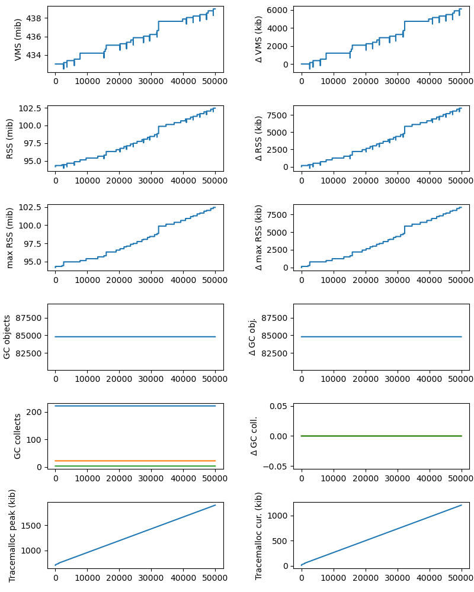

The top row shows the virtual memory (total memory size, including swap), tracked with `psutil`.
The left panel shows the program total, while the right shows the increase (or decrease) since the first point.
A clear increase is visible here, although it doesn't look smooth.
This is probably explained by Python allocating within memory that was already part of it's VMS, so increase comes in short bursts.

A similar pattern is seen on the next row, which shows resident set size (RAM usage), again tracked with `psutil`.
Like VMS, this goes up and occasionally down for a short period, but with a clear upward trend.

The next row shows _maximum RSS_, as tracked by `resource`.
Because this is a peak value, there are no decreases, and so we see a shaky but clear increase.

The next row shows the number of objects tracked by `gc`.
This remains constant because `PyFloat` objects are not tracked.

On the next row we see the number of garbage collection runs (for generations 0, 1, and 2).
GC is never initiated during this experiment!

Finally, using `tracemalloc` we plot the memory traced (not allocated!) by Python.
The left panel shows peak memory, the right panel shows current.
We can see a clear and steady increase with each iteration.

Because this last graph is so clear, we can repeat this with fewer iterations:

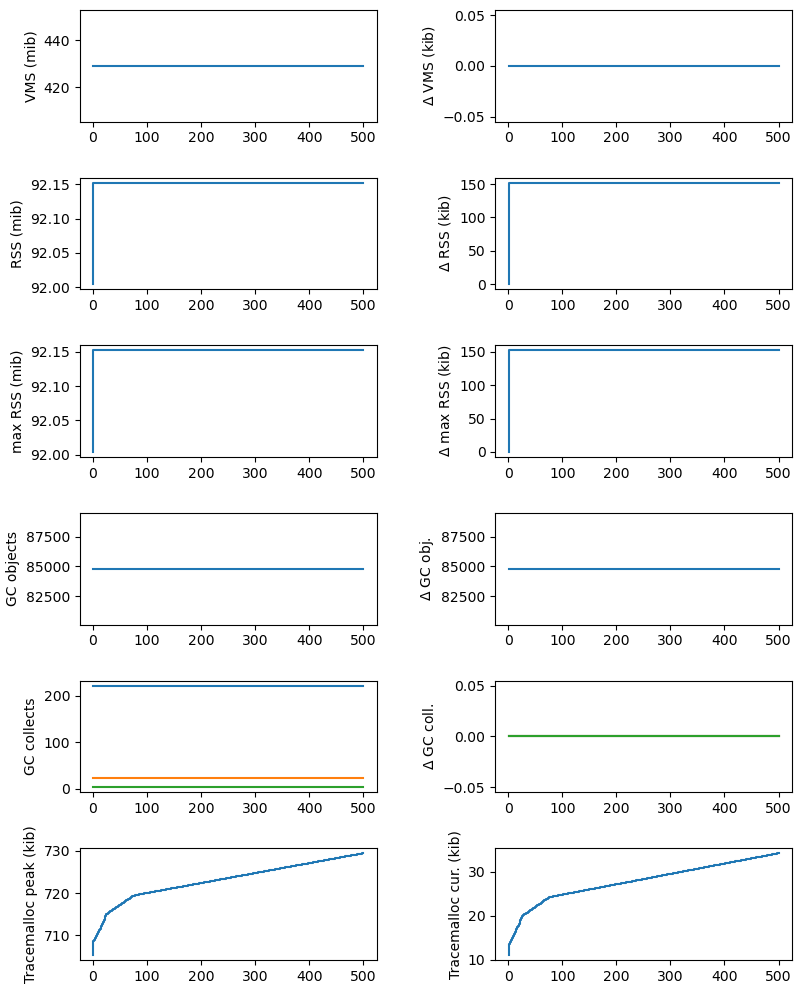

Now we see that there is some sharp memory increase in the first ~80 iterations (some caches filling up?), after which our memory leak shows up as a clear increase in tracemalloc traced memory.

### Leaking 1 empty list per iteration

Here I added
```
PyList_New(0);
```
to the C-code, to create a new but empty list.

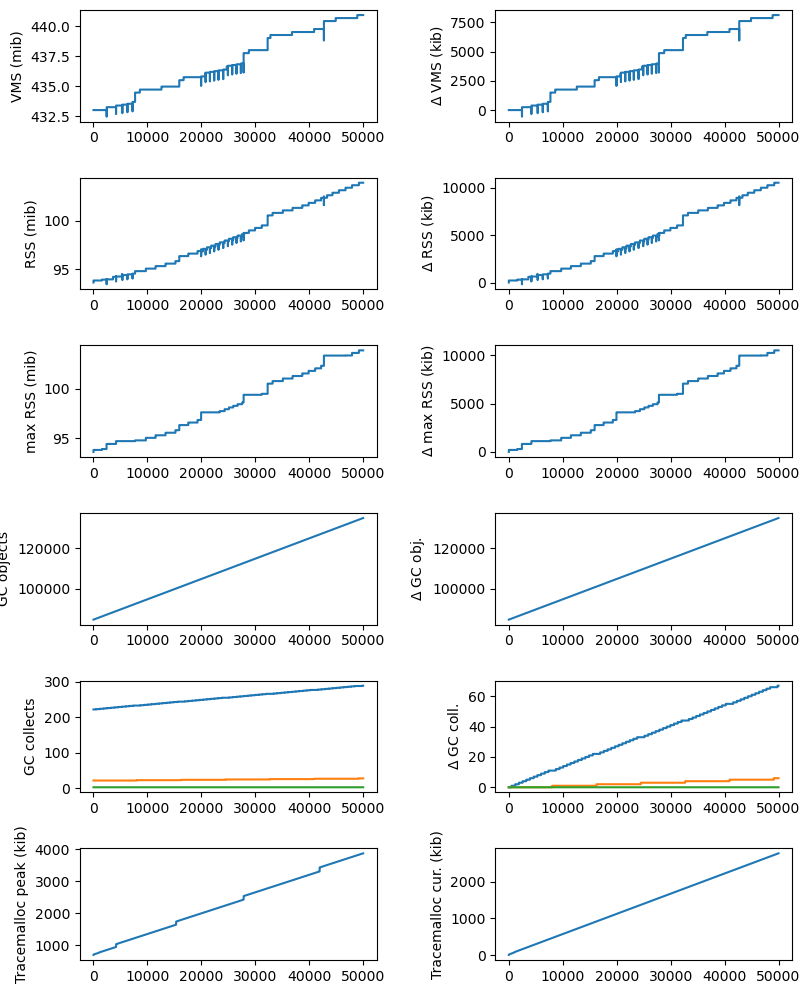

As before we see a shaky increase in VMS, RSS, and max RSS.
The slope of the increase is greater, as empty lists take up more space than floats.

But we also see a strong increase in the number of GC-traced items, leading to several garbage collections.

As before, we see a steady increase in tracemalloc traced memory.

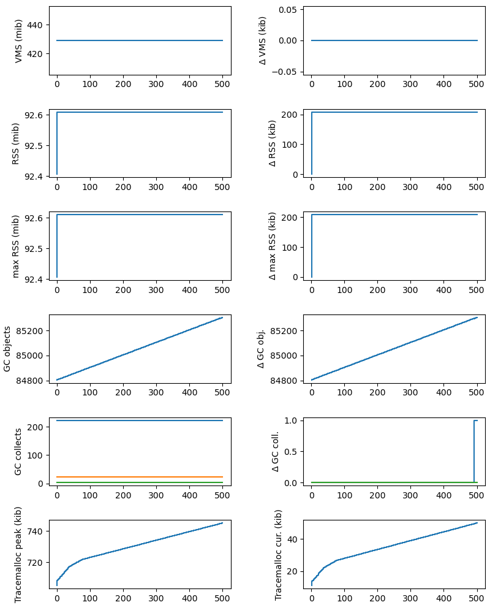

Again, a shorter test would suffice: we can see a clear increase in the `tracemalloc` graph, plus a clear increase in GC-traced objects.

### Leaking 1 C double per iteration

Now we add something more subtle:
```
realtype* x = (realtype*)malloc(sizeof(realtype) * 1);
for(i=0; i<1; i++) {
    x[i] = 1.23;
}
```
This allocates space for 1 "realtype", an alias for a `double`.
Note that I had to assign a value to the allocated space: without it the compiler spotted unused code and removed it!

Again we try with 50000 iterations:

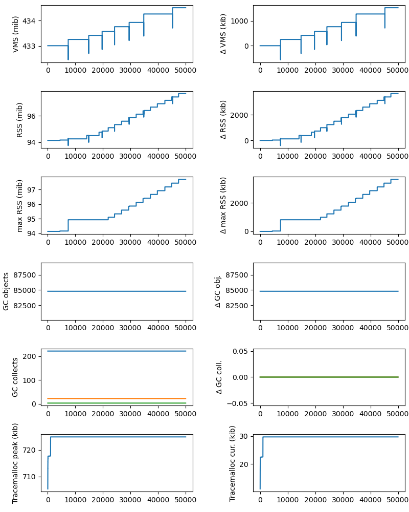

Now we can see a very shaky increase in RSS and max RSS, leading to an even slower increase in VMS (which includes a lot of unused space!).

As expected, `gc` and `tracemalloc` don't pick up on this (no Python involved!). 

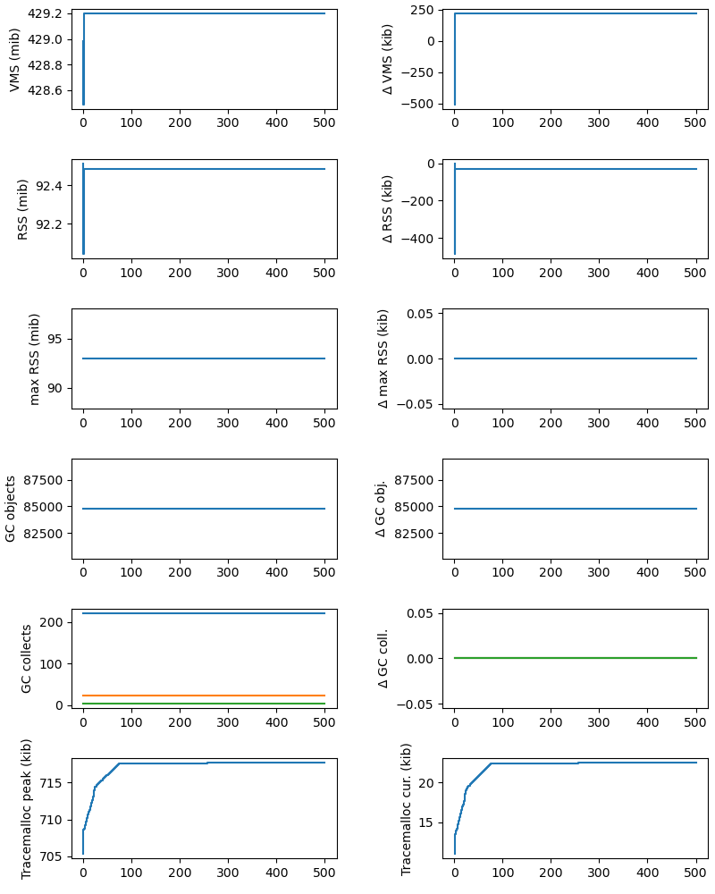

Shorter tests are troublesome.
From 500 iterations you might not guess there's a problem.

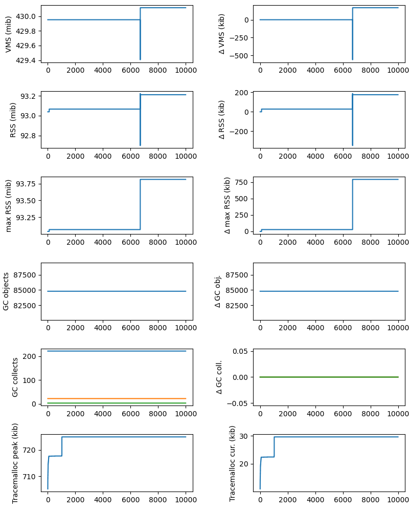

And even from 10000 iterations it's hard to be sure.
This is the only tested case that requires* a high number of iterations.

(*unless you don't care about minor memory leaks!)

### Leaking 100 C doubles per iteration

Now we update the code to use 100 doubles:
```
realtype* x = (realtype*)malloc(sizeof(realtype) * 100);
for(i=0; i<100; i++) {
    x[i] = 1.23;
}
```

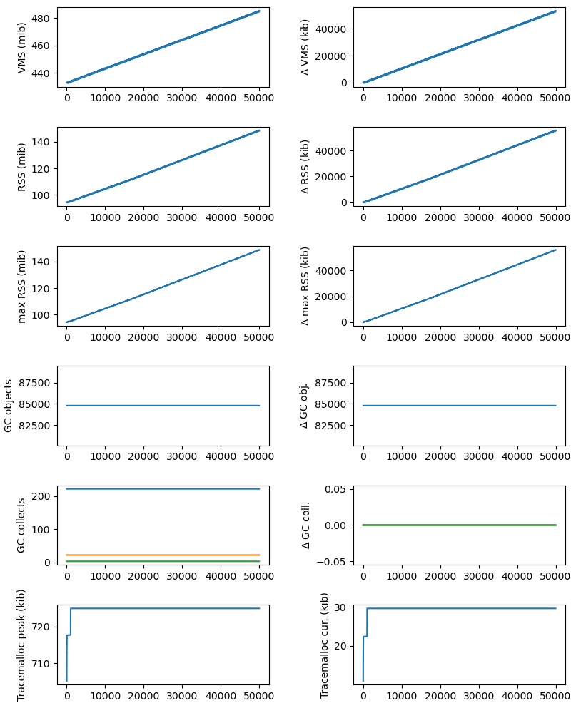

This leads to a steady increase in resident and virtual memory (again without showing up in the Python graphs).

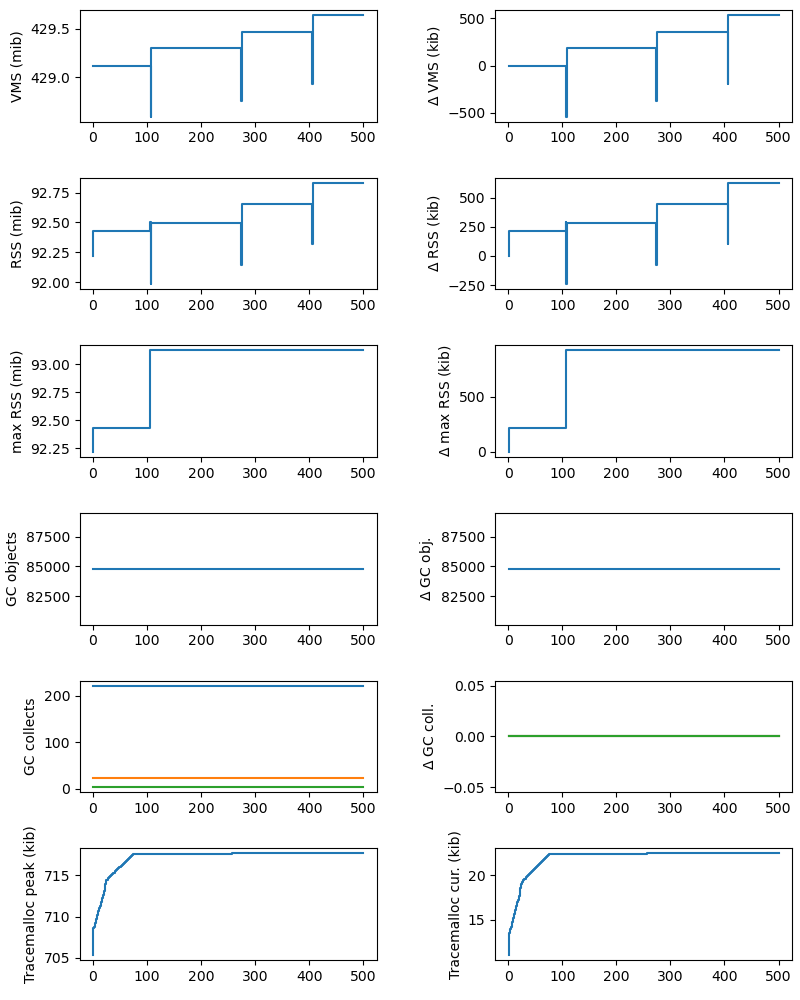

It's not quite as clear with just 500 iterations.
Looking at the units though, you can spot half a megabyte of extra memory use in "only" 500 iterations, which could be enough to make you investigate!
(For pride if not for practicality).

### No deliberate leaks

Finally, we look at the code with no deliberate leaks:

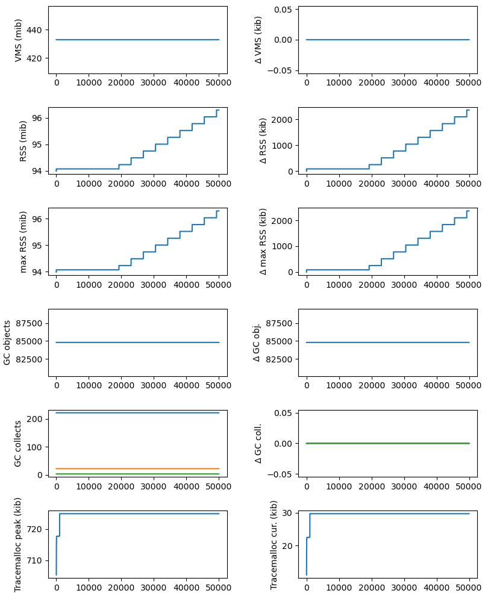

Hmmm


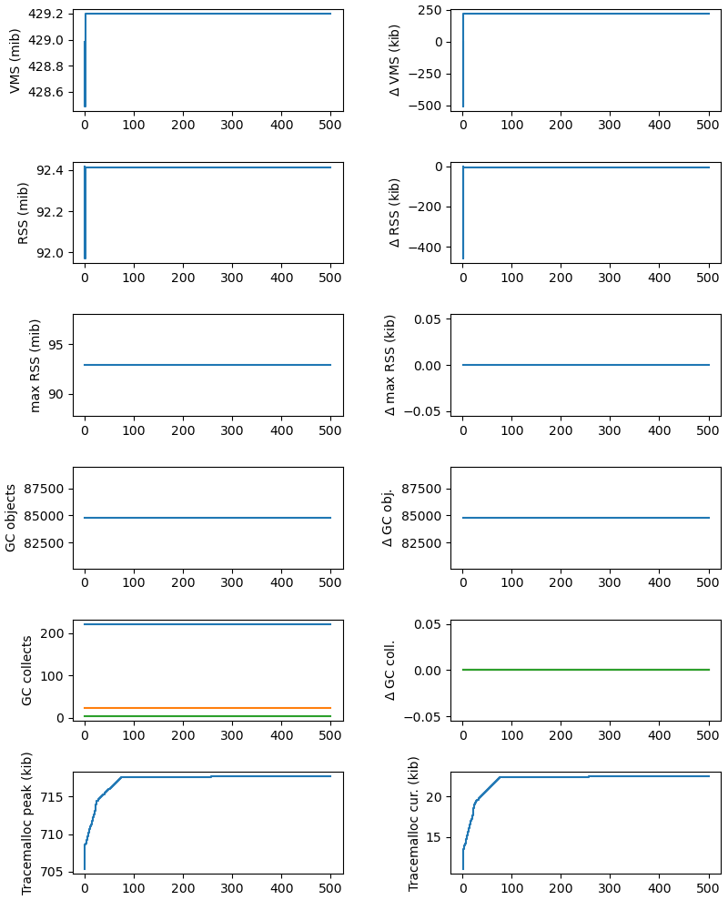


#
